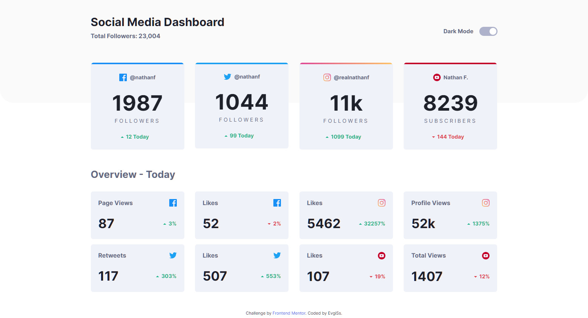
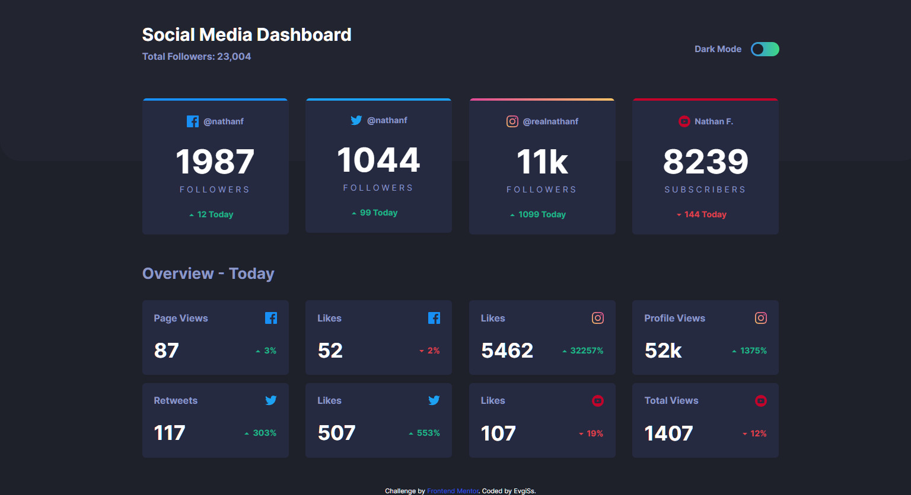
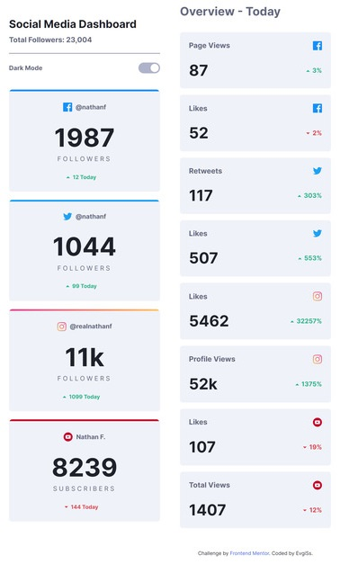

This is a solution to the [Social media dashboard with theme switcher challenge on Frontend Mentor](https://www.frontendmentor.io/challenges/social-media-dashboard-with-theme-switcher-6oY8ozp_H). Frontend Mentor challenges help you improve your coding skills by building realistic projects.

## Overview

### The challenge

Users should be able to:

- View the optimal layout for the site depending on their device's screen size
- See hover states for all interactive elements on the page
- Toggle color theme to their preference
- Checking the user's preferred theme (in operating system settings) and changing the theme on page load

### Links

- [Solution URL](https://github.com/EugiSs/social-media-dashboard-with-theme-switcher)
- [Live Site URL](https://eugiss.github.io/social-media-dashboard-with-theme-switcher/)

### Screenshot

## My process

### Built with

- Semantic HTML5 markup
- CSS custom properties
- JS
- Flexbox
- Mobile-first workflow
- [Vue3](https://v3.ru.vuejs.org/) - Composition API
- [Pinia](https://pinia.vuejs.org/) - for Store

### What I learned

app development with Vue3, Composition API

## Author

- Website - [EugiSs](https://github.com/EugiSs)
- Frontend Mentor - [@Eugi](https://www.frontendmentor.io/profile/EugiSs)
